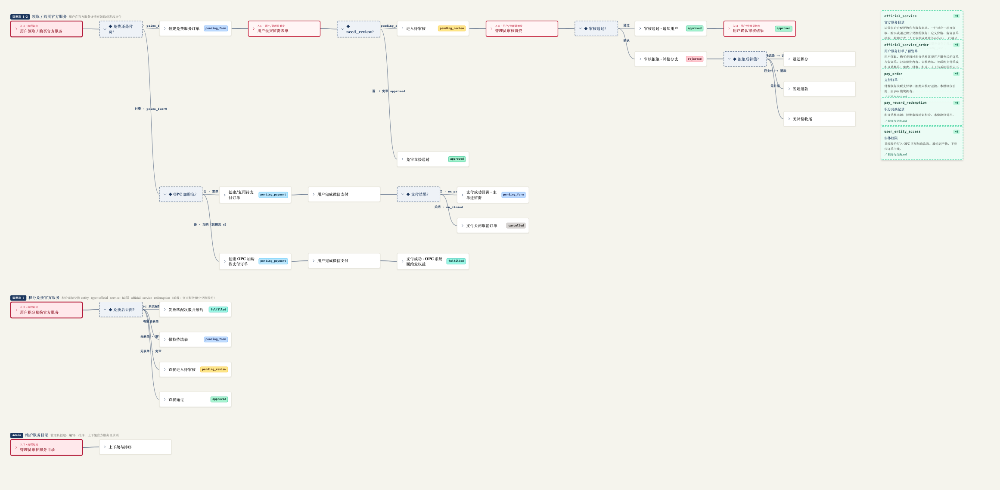
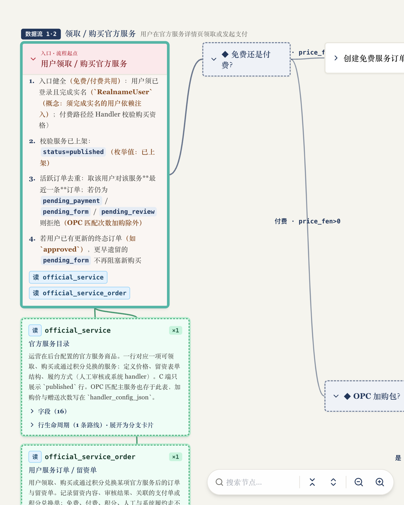
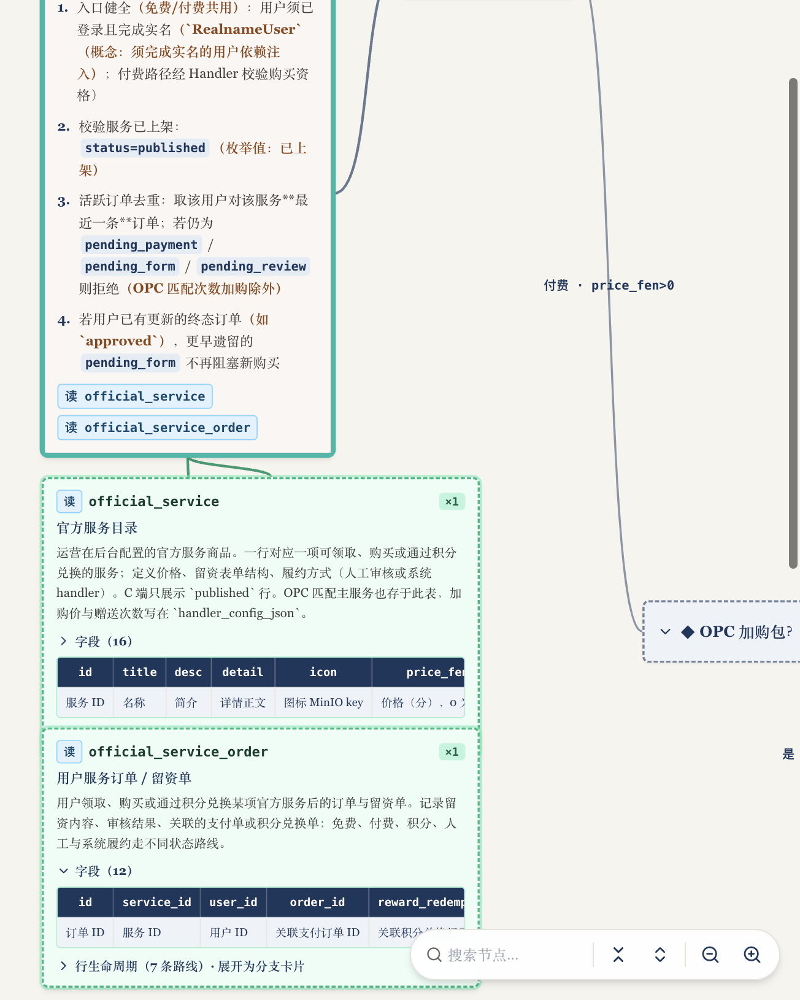
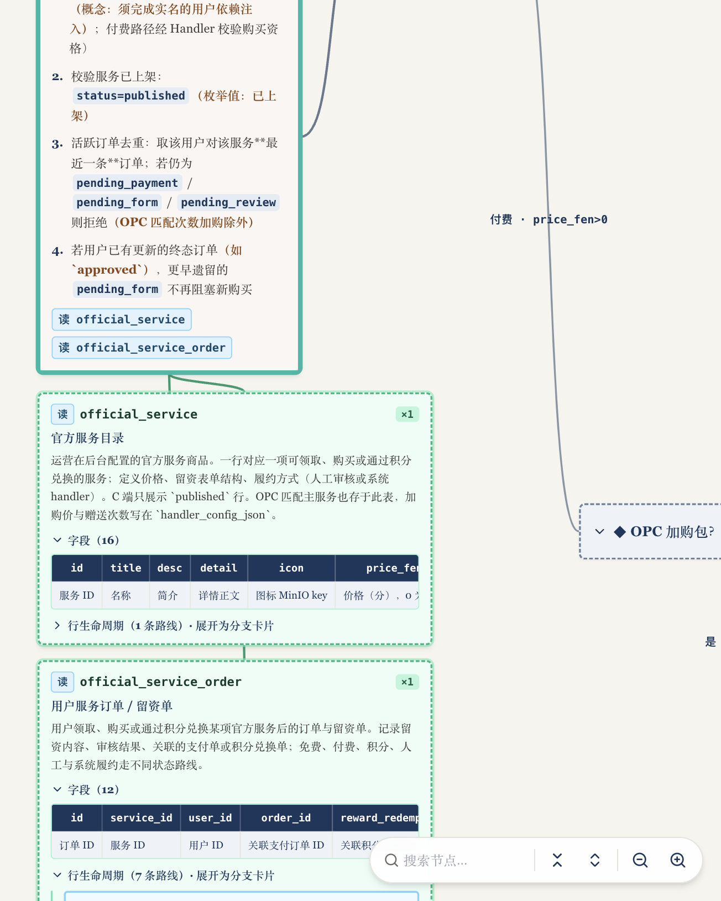
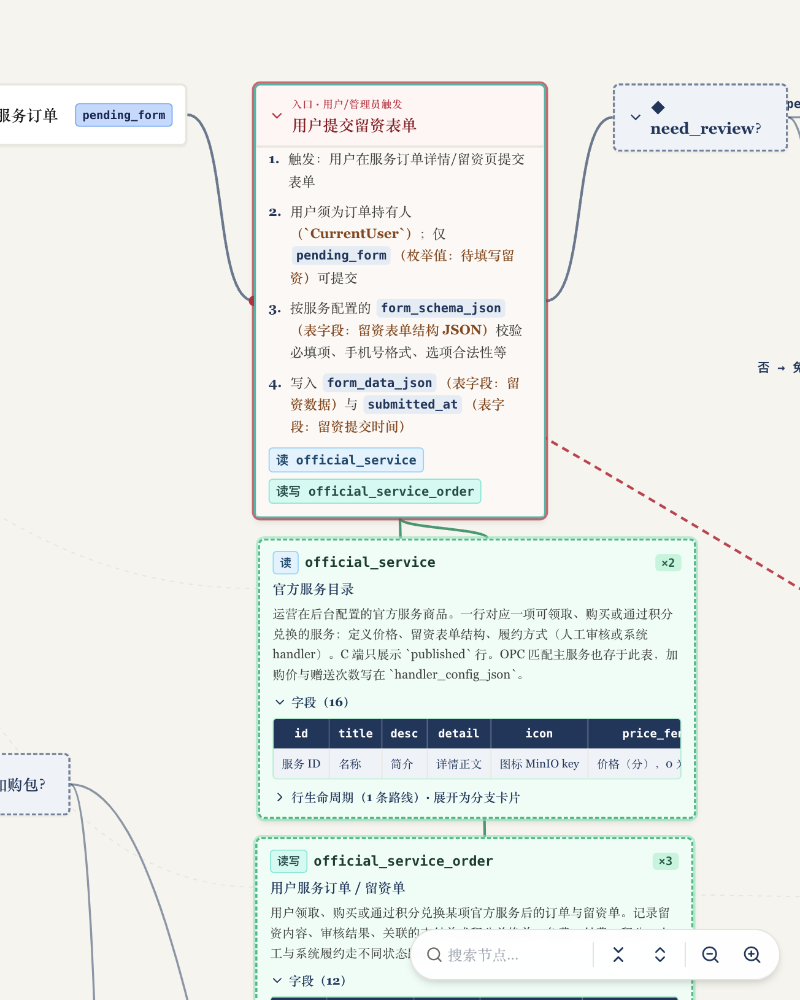

# 案例图（官方服务 · Git 图）

来源页面：`docs/un-commit/preview/official-service-interactive-flow.html`  
截图目录：[assets/examples/](assets/examples/)

做新模块可视化时，先对照这些图，再改数据与样式；不要另起一套视觉语言。

---

## 01 · 全景（折叠细节、展开分支）

**要看出什么**

- 整幅画布缩到能一眼看见：三条路径 + 右侧表栏（缩放约 `0.3`，比 UI 工具栏最小档 `0.55` 更小）
- 多条路径上下并行；同路径左→右串联
- 入口卡深红；决策 `◆` 虚线框；状态 chip
- 右侧为未聚焦时的数据表栏
- 不是思维导图式分类并列

**重截要点**：用 headless 把 `transform: scale` 压到内容宽高入镜（勿只点工具栏「缩小」到 disabled——那仍可能裁掉右侧表栏）。静态全景导出时保持此骨架，决策全开，逻辑正文可折叠只留标题。

---

## 02 · 逻辑 / 入口卡展开 + 表卡上下吸附

**要看出什么**

- 入口展开后有编号 bullet、读写 chip
- 关联表卡挂在**下方**（竖向绿线），不在流程左右
- 展开后邻卡被推开（碰撞），主时序仍可读

---

## 03 · 数据表字段横表

**要看出什么**

- 一行字段横排：上 = 英文字段名（墨蓝底白字），下 = 中文含义
- 可横向滚动，不要改成左右两列长列表

---

## 04 · 表卡上下文（字段 / 生命周期入口）

**要看出什么**

- 「行生命周期 · 展开为分支卡片」为可折叠入口
- 表卡虚线绿框；与逻辑卡的读写关系用 chip + 竖线表达

> 生命周期完全展开后，每条路线是独立彩色小卡（见参考实现 `TableHubCard`）。若需更新截图：展开订单表「行生命周期」后重截。

---

## 05 · 汇入时序（点击连线）

**要看出什么**

- 从「→ 时序：…」跳到真实时序节点并展开目标
- 主时序不常驻满屏汇入线；点击后才强调关系
- 目标若是入口触发，仍用深红入口样式

---

## 模板索引

| 模板 | 路径 |
|------|------|
| 类型定义 | [templates/data-types.ts](templates/data-types.ts) |
| 数据骨架 | [templates/data-skeleton.ts](templates/data-skeleton.ts) |
| 目录结构 | [templates/project-structure.md](templates/project-structure.md) |
| CSS tokens | [templates/styles.css](templates/styles.css) |
| 卡片 JSX | [templates/card-markup.tsx](templates/card-markup.tsx) |
