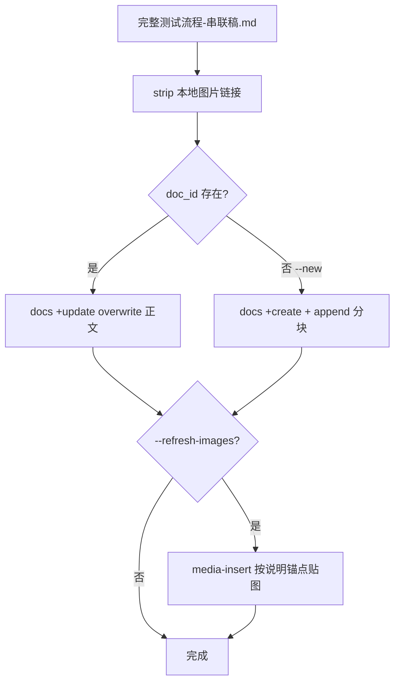

# 飞书串联稿发布手册

> **输入**：[`docs/Testing/完整测试流程-串联稿.md`](../../../docs/Testing/完整测试流程-串联稿.md)（阶段 3 产物）  
> **canonical 配置**：[`docs/Testing/.feishu-flow-doc.json`](../../../docs/Testing/.feishu-flow-doc.json)  
> **脚本**：[`scripts/audit/publish-flow-to-lark.py`](../../../scripts/audit/publish-flow-to-lark.py)

---

## 1. 原则

| 原则 | 说明 |
|------|------|
| 同一文档 | 读/写 `.feishu-flow-doc.json` 中的 `doc_id`，**不新建第二篇** |
| 贴图不裸传 | 用 `lark-cli docs +media-insert --before --selection-with-ellipsis` |
| **overwrite 必重贴图** | `docs +update --mode overwrite` 会清空正文块（含已贴图片）；默认发布脚本会**自动重贴** |
| 相对路径 | `--file` 必须用相对仓库根的路径，如 `docs/Testing/证据/.../01.png` |

---

## 2. 命令

```bash
cd /path/to/JiaZhuang

# 预览
python3 scripts/audit/publish-flow-to-lark.py --dry-run

# 就地更新正文 + 重贴证据图（默认，~10 分钟）
python3 scripts/audit/publish-flow-to-lark.py

# 仅改正文、不重贴图（会丢图！仅调试文案时用）
python3 scripts/audit/publish-flow-to-lark.py --text-only

# 指定 doc_id
python3 scripts/audit/publish-flow-to-lark.py --doc-id Xtn7dqU6soOSDJxV6JocutgZnqc

# 仅首次创建（会写 .feishu-flow-doc.json）
python3 scripts/audit/publish-flow-to-lark.py --new --refresh-images
```

---

## 3. 发布流程



### 3.1 正文

- 串联稿内 `` 在发布前**剥离**（飞书不含 markdown 图片链接）
- 本地 `<text background-color="red/orange">` 配色保留
- `overwrite` 会**清空**文档正文块 — 若文档内已有图片且不同步重传，图片会消失

### 3.2 图片（media-insert）

对每个证据组：

1. 解析串联稿中 `**说明**：` 后的 caption
2. 锚点：caption 全文（短）或 `开头12字...结尾12字`（长）
3. `--before` 插入到说明文字**上方**
4. 组内多图**逆序**插入以保持正序

```bash
lark-cli docs +media-insert --as bot \
  --doc "$DOC_ID" \
  --file "docs/Testing/证据/CU-DOCX-20260709/TC_GATE_S2_001/01.png" \
  --before \
  --selection-with-ellipsis "不勾选协议没办法...没办法点击确认按钮。" \
  --align center --width 680
```

**禁止**：`<image url="file://...">`、drive 单独上传后不 bind block。

---

## 4. overwrite 与图片的关系（重要）

飞书文档里，**文字块**和**图片块**是分开的：

1. 正文通过 `docs +update --mode overwrite` 写入（markdown 里不含 `![...]`，发布前已 strip）
2. 证据图通过 `docs +media-insert` 单独插入到「**说明**：…」文字上方

因此 **`overwrite` = 整篇正文块重建**，之前 `media-insert` 贴进去的图片会**一并被清掉**。

| 操作 | 正文 | 图片 |
|------|------|------|
| `publish-flow-to-lark.py`（默认） | 更新 | **自动重贴**（因 overwrite 会清空） |
| `--text-only` | 更新 | **丢失**（勿用于正式发布） |
| 只改本地串联稿未发布 | — | 飞书不变 |

**不是**「证据没变就不用传」——只要跑了 overwrite，就必须重贴图（或改用不 wipe 全文的更新 API，当前脚本未实现）。

---

## 5. 权限与身份

- 使用 **`--as bot`** 创建/更新
- 创建时自动为 CLI 用户授予 `full_access`（见 create 响应 `permission_grant`）
- 用户身份 `docs +create` 需额外 scope，优先 bot

---

## 6. 故障排查

| 现象 | 处理 |
|------|------|
| `定位表达式开头和结尾不能为空` | 锚点改用 `开头...结尾` 格式，去掉 `**说明**：` 前缀 |
| `unsafe file path` | 使用相对路径，cwd 为仓库根 |
| 图片贴错位置 | 检查 caption 是否唯一；加长锚点 |
| 新建了第二篇 doc | 更新 `.feishu-flow-doc.json`，以后勿加 `--new` |

---

## 7. 配置文件示例

```json
{
  "doc_id": "Xtn7dqU6soOSDJxV6JocutgZnqc",
  "doc_url": "https://www.feishu.cn/docx/Xtn7dqU6soOSDJxV6JocutgZnqc",
  "title": "假装小程序 · 完整测试流程（串联稿）"
}
```
